# 🏗️ End-to-End Azure CDC Data Ingestion & Warehouse Automation  
## Airbnb Data Engineering Project

---

## 📌 Project Overview

This project demonstrates a complete end-to-end Azure Data Engineering solution simulating a real-world Change Data Capture (CDC) scenario using Microsoft Azure services.

### Business Scenario

- A source team uploads daily customer files to Azure Data Lake Storage (ADLS).
- Booking transactions are generated in Azure Cosmos DB.
- Data pipelines ingest, validate, transform, and load structured data into Azure Synapse Analytics.
- Aggregated reporting tables are automatically refreshed.

The solution ensures:

- Automated ingestion
- CDC handling for updates
- Data validation
- Dimensional modeling
- Orchestrated workflows
- File lifecycle management

---

# 🏛️ Architecture Overview

## 🔹 Data Sources

### 1️⃣ Azure Data Lake Storage (ADLS)

Container structure:

```
airbnb/
│
├── customer-raw-data/
└── customer-data-archive/
```

- Daily files arrive in `customer-raw-data`
- After processing → moved to `customer-data-archive`
- Raw files are deleted after successful ingestion

<p align="center">
  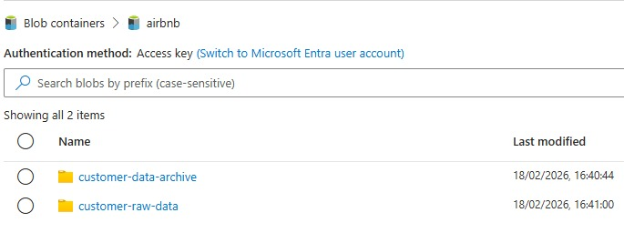
</p>

---

### 2️⃣ Azure Cosmos DB

- Database: `AirBnB`
- Container: `bookings`

Mock booking data is generated using a Python script.

Example document structure:

```python
{
    "id": booking_id,
    "booking_id": booking_id,
    "customer_id": str(customer_id),
    "listing_id": str(random.randint(100000, 999999)),
    "status": "Confirmed",
    "booking_created_at": booking_created_at.isoformat(),
    "checkin_date": checkin_date.isoformat(),
    "checkout_date": checkout_date.isoformat(),
    "nights": nights,
    "lead_time_days": lead_time,
    "guests_adults": max(1, int(random.triangular(1, 3, 2))),
    "guests_children": 1 if random.random() < 0.25 else 0,
    "guests_infants": 1 if random.random() < 0.05 else 0,
    "price_nightly": price_nightly,
    "cleaning_fee": cleaning_fee,
    "total_amount": total_amount,
    "currency": currency,
    "country_code": city["country"],
    "city": city["city"],
    "channel": channel,
    "device_type": device,
    "cancellation_ts": None,
    "cancellation_reason": None,
    "updated_at": datetime.now(timezone.utc).isoformat()
}
```

Because booking records can change (e.g., Confirmed → Cancelled), CDC logic is implemented.
<p align="center">
  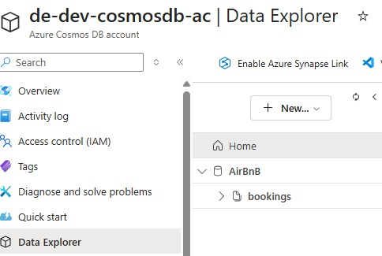
</p>


---

# 🏢 Data Warehouse – Azure Synapse (Dedicated SQL Pool)

<p align="center">
  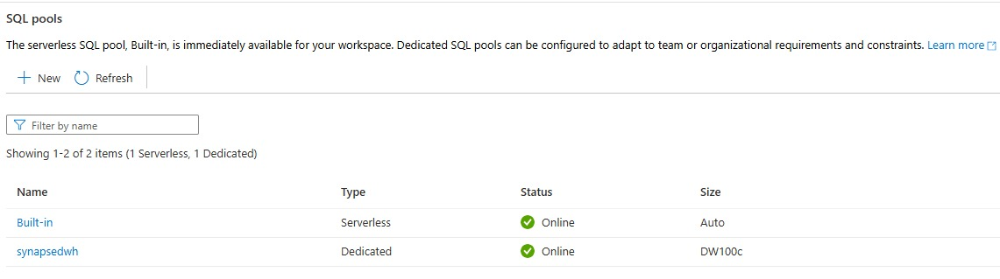
</p>


## Schema Objects

- `airbnb.dim_customer`
- `airbnb.fact_booking`
- `airbnb.BookingCustomerAggregations`

## Stored Procedure

- `airbnb.BookingAggregation`
  - Populates aggregation table from fact data

<p align="center">
  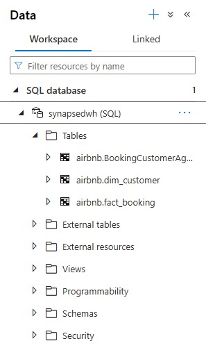
</p>


---

# ⚙️ Azure Data Factory Implementation

## 🔗 Linked Services

- Azure Data Lake Storage
- Azure Cosmos DB
- Azure Synapse Analytics

<p align="center">
  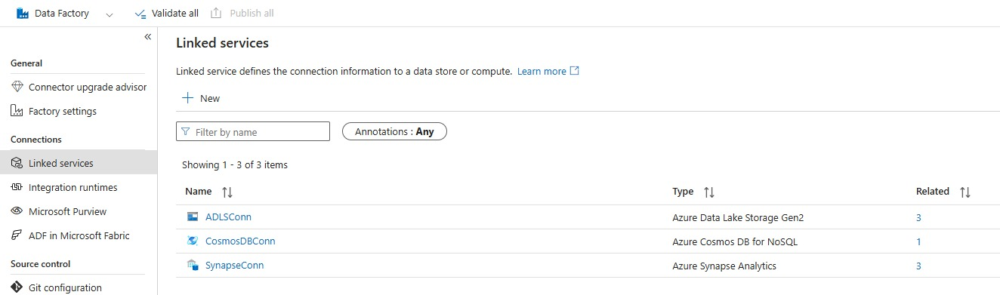
</p>


---

## 📦 Datasets

- `New_CustomerDataSource`
- `New_CustomerDataArchive`
- `New_BookingDataCosmosDBSource`
- `New_BookingsFactSynapse`
- `New_CustomerDimSynapse`

<p align="center">
  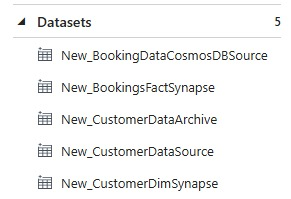
</p>


---

# 🔄 Pipeline 1 – Load Customer Dimension  
**Pipeline Name:** `New_LoadCustomerDim`

### Steps

1. Read files from `customer-raw-data`
2. Copy data into `airbnb.dim_customer`
3. Archive processed files
4. Delete raw files

<p align="center">
  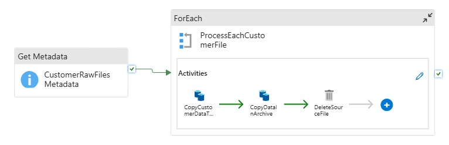
</p>

<p align="center">
  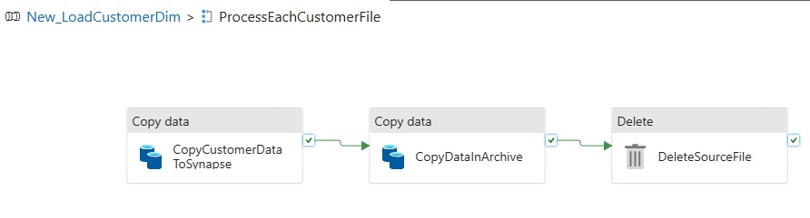
</p>


---

# 🔄 Pipeline 2 – Load Booking Fact with CDC  
**Pipeline Name:** `New_LoadBookingFact`

## Data Flow – Booking Transformation

### Step 1 – Source
Cosmos DB `bookings`

### Step 2 – Data Validation

Split records:

- If `checkout_date < checkin_date` → BadRecords
- Else → AcceptedRecords

### Step 3 – CDC Logic

- Lookup against Synapse using `booking_id`
- Compare using `updated_at`
- Apply Alter Row:
  - INSERT → if not exists
  - UPDATE → if exists

### Step 4 – Sink

Write to `airbnb.fact_booking`

### Step 5 – Aggregation

Execute stored procedure

**Data Flow:**

<p align="center">
  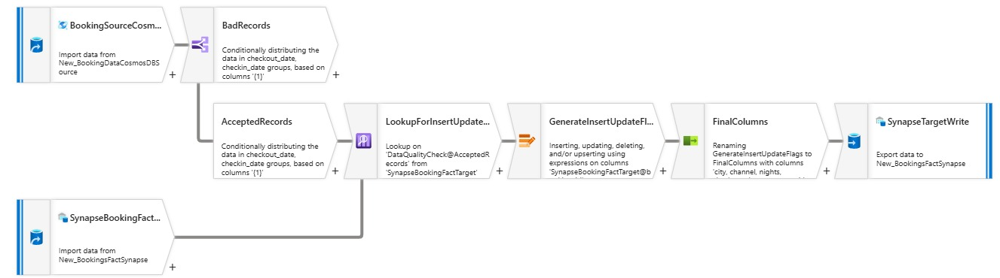
</p>


**Pipeline 2:**

<p align="center">
  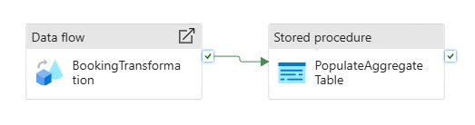
</p>

---

# 🔄 Pipeline 3 – FinalAirBnBPipeline

Sequential execution:

1. `New_LoadCustomerDim`
2. `New_LoadBookingFact`

<p align="center">
  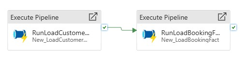
</p>


New File added to `customer-raw-data` directory to run and test pipeline execution.

<p align="center">
  
</p>


---


# 📊 Monitoring

Final pipeline is  Manually triggered and all pipelines are monitored using the Azure Data Factory **Monitor** tab.

<p align="center">
  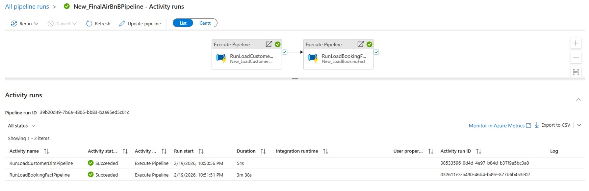
</p>
<p align="center">
  
</p>
<p align="center">
  
</p>
<p align="center">
  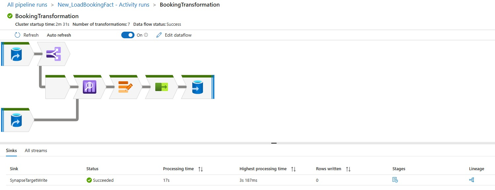
</p>

---

# 🔍 Verification

After successful pipeline execution, validation is performed at three levels:

## 1️⃣ Data Warehouse Validation (Azure Synapse)

```sql
SELECT COUNT(*) FROM airbnb.dim_customer;
SELECT COUNT(*) FROM airbnb.fact_booking;
SELECT COUNT(*) FROM airbnb.BookingCustomerAggregations;
```
<p align="center">
  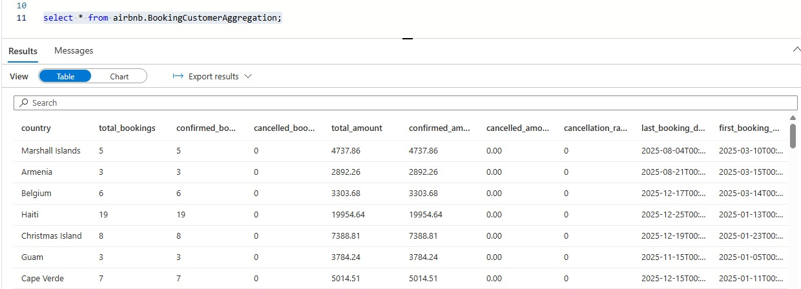
</p>


## 2️⃣ 💾 Storage Account Validation (ADLS)

- 🗂 Files removed from `customer-raw-data/`
- 📦 Files moved to `customer-data-archive/`

<p align="center">
  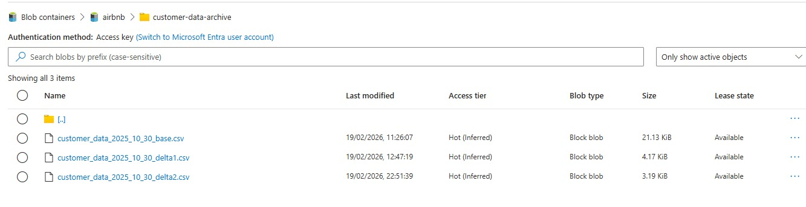
</p>

---

# ⭐ Data Model – Star Schema

### Dimension
- `dim_customer`

### Fact
- `fact_booking`

### Aggregation
- `BookingCustomerAggregations`

Enables:

- Revenue per customer
- Booking trends
- Cancellation analysis
- Customer lifetime value metrics

---

# 🚀 Key Engineering Concepts Demonstrated

- End-to-End Data Engineering Architecture
- Change Data Capture (CDC)
- Data Validation using Data Flows
- Incremental Insert & Update Logic
- Star Schema Modeling
- Stored Procedure-based Aggregation
- File Lifecycle Management
- Pipeline Orchestration & Monitoring
- Scalable Cloud Data Warehouse Design

---

# 🧠 Why This Project Matters

This project simulates a realistic enterprise-grade data platform where:

- Multiple data sources integrate into a centralized warehouse
- CDC ensures data consistency
- Pipelines are automated and production-ready
- Data is transformed into analytics-ready models

It demonstrates strong practical knowledge of:

- Azure Data Factory
- Azure Synapse Analytics
- Azure Data Lake Storage
- Azure Cosmos DB
- Data Warehousing & CDC Patterns

---

## 👩‍💻 Author

**Amber Asad**  
Data Engineer | Azure | Data Warehousing | CDC | Cloud Analytics
